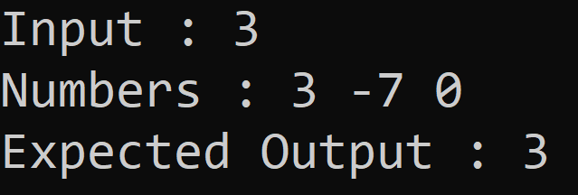
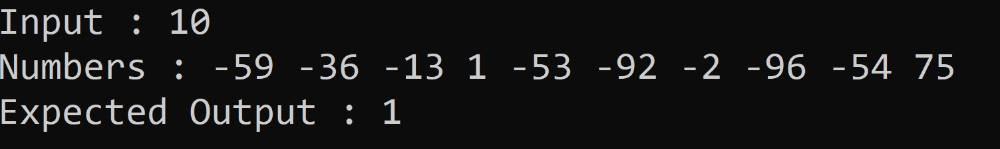
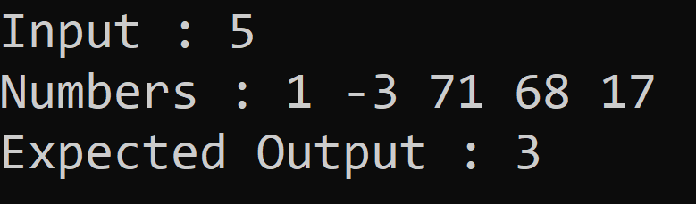
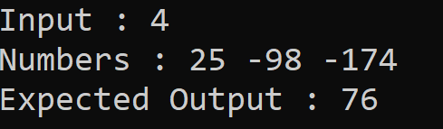

# Minimum-Absolute-Difference-in-an-Array

<b>Dizi içerisindeki sayıların mutlak farklarının en küçüğünü ekrana yazdıran algoritma.</b>  

<b> arr = [3,-7,0] 
 |3-(-7)| = 10 ,  |3-0| = 3 , |-7-0| = 7 , en küçük fark 3'tür. Ekrana 3 değerini döndürür.</b>  
  
  
   
    
